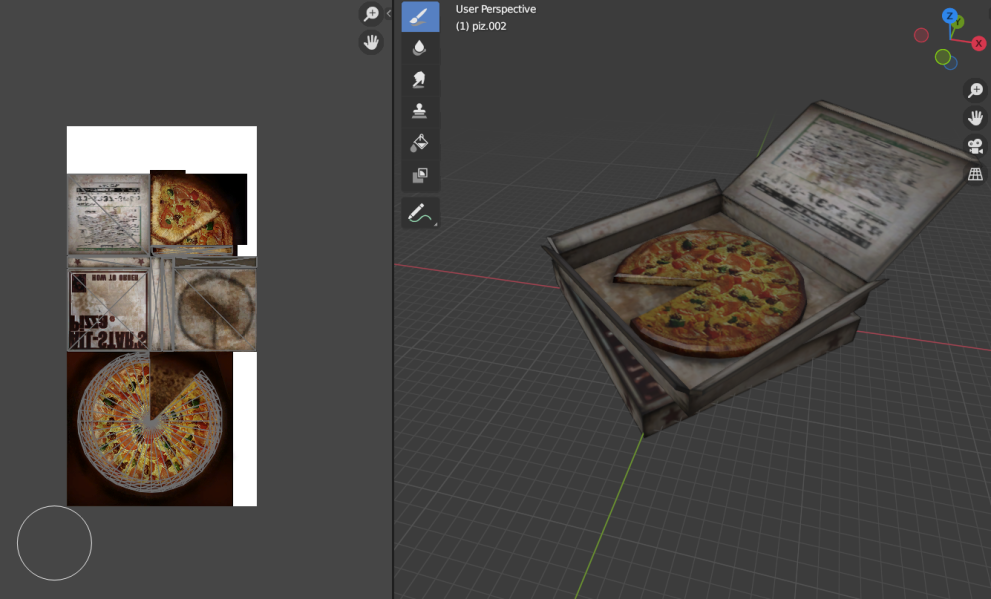

# Silent Hill Explorer

Resources for exploring Silent Hill game files. Currently only for Silent Hill 2 (PC).

Update to support characters coming soon!




## Setup

To just extract meshes (.obj files), there are no dependencies other than [Python](https://www.python.org/downloads/)—I'm using 3.11.

To extract textures, I'm using NumPy and PIL to output images. To install those, you can run the following command. Again, this is only necessary for getting image data.

```sh
python3 -m pip install -r requirements.txt
```

## Extract 3D Models

I couldn't find a simple way to extract .obj files from Silent Hill's binary .mdl files.

I really wanted to figure it out, so here we are...

Please note that this is only tested for PC .mdl files. I've heard PS2 files have quite a different structure, but I haven't really looked into it.

1. Create a new folder called `input` in the root folder of this repo and copy any .mdl files there. (The .mdl files live in the data directory of the game folder.)

2. Open up a terminal and run something like the following commands.

```sh
cd path/to/this/folder
python3 src/mesh.py input/my_model.mdl
```

If all goes well, an .obj file will appear in `output`, which can be loaded into Blender.

You can also input an entire folder for batch processing, like so.

```sh
python3 src/mesh.py input/folder
```

## Extract textures

Very much so in development, but I have something working. If you want a much more robust solution for extracting Silent Hill 2 textures, see [sh2tex](https://github.com/iOrange/sh2tex).

But if you want the convenience of having everything all in one place, or you're just curious about my code, or you're just silly, you can run the following on a .mdl file, or a folder containing .mdl files.

```sh
cd path/to/this/folder
python3 src/texture.py input/my_model.mdl
```

If all goes well, you should see a .png file appear in `output`, which can be used as an image texture in Blender. The result of `x_keypurple.mdl` looks like this:


By default, the textures will be vertically flipped, and this is how they should be used as textures. If you don't like that, you can use `--unflip`, e.g. `python3 src/texture.py input/my_model.mdl --unflip`.

## TODO

- [ ] Fix occasional strange geometry in obj files.
- [ ] Implement transparency for textures. (This is the entire difference between each of the [DXT texture compression](https://en.wikipedia.org/wiki/S3_Texture_Compression) methods, and I'm just ignoring all of it at the moment.)
- [ ] Texture extraction may be a little slow on some machines. Can probably fix by actually using Numpy (I reluctantly added it as a dependency for this)
- [ ] Possibly investigate PS2 file structure. (low priority for me)

## Disclaimer

This is for educational purposes only, please be mindful. I do not claim responsibility for any misuse of this software. I'm just exploring this stuff on my own because I like the games and I want to learn more about how they work.
